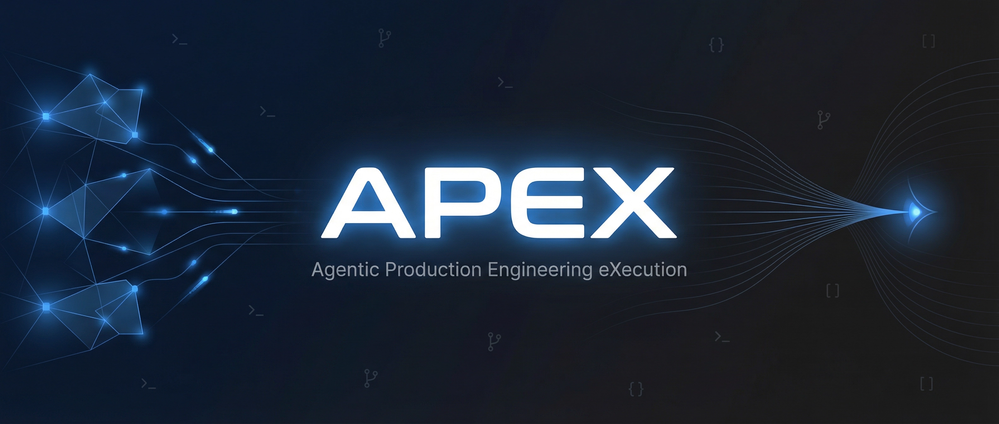

<p align="center">
  
</p>

<p align="center">
  <strong>Work at Kilo Speed</strong> — the methodology that turned a 6-12 month replatforming project into <strong>4 weeks of solo work</strong>.
</p>

<p align="center">
  <a href="https://github.com/OthmanAdi/APEX/actions/workflows/skill-validation.yml"></a>
  <a href="https://getskillcheck.com"></a>
  <a href="https://opensource.org/licenses/MIT"></a>
  <a href="https://github.com/OthmanAdi/APEX"></a>
</p>

<p align="center">
  <a href="https://code.claude.com/docs/en/skills"></a>
  <a href="https://docs.cursor.com/context/skills"></a>
  <a href="https://docs.codeium.com/windsurf"></a>
  <a href="https://github.com/openai/codex"></a>
  <a href="https://geminicli.com/docs/cli/skills/"></a>
</p>

<p align="center">
  <a href="https://agentskills.io"></a>
  <a href="https://github.com/OthmanAdi/APEX"></a>
</p>

---

# APEX

**Agentic Production Engineering eXecution**

A cross-platform skill framework for AI-driven replatforming, migration, and high-velocity engineering workflows. Inspired by the [Kilo Speed methodology](https://blog.kilo.ai/p/inside-kilo-speed-how-one-engineer-52c).

<details>
<summary><strong>💬 A Note from the Author</strong></summary>

I created APEX after studying how Mark IJbema at Kilo Code completed a 6-12 month replatforming project in just 4 weeks. His secret wasn't better tools — it was a **methodology** for working with AI agents at different trust levels.

APEX operationalizes that methodology into 6 reusable skills. If it helps you work faster, that's all I wanted.

</details>

<details>
<summary><strong>📊 Benchmarks (Coming Soon)</strong></summary>

APEX is being formally evaluated using Anthropic's skill-creator framework. Results will be published here once testing is complete.

**Planned metrics:**
- Velocity improvement (traditional vs APEX)
- Task completion rate
- Agent autonomy levels

[Follow the repo](https://github.com/OthmanAdi/APEX) to get notified when benchmarks are published.

</details>

<details>
<summary><strong>🤝 Community Showcase</strong></summary>

This section will feature community forks and extensions once available.

*Built something with APEX? [Open an issue](https://github.com/OthmanAdi/APEX/issues) to get listed!*

</details>

---

## Why APEX?

In March 2026, [Kilo Code published how one engineer](https://blog.kilo.ai/p/inside-kilo-speed-how-one-engineer-52c) completed a VS Code extension replatforming in 4 weeks — a project traditionally estimated at 6-12 months with a team.

His secret wasn't magic. It was **calibrated delegation**:

> "I don't think there are any tasks I wouldn't do with an LLM. It's about finding the right scope."
> — Mark IJbema, Kilo Code

APEX turns this methodology into 6 installable skills.

## The Problem

Traditional replatforming and migration projects take **6-12 months** with a dedicated team. Engineers spend countless hours on:
- Manually analyzing legacy codebases feature by feature
- Writing detailed specifications by hand
- Implementing the same logic in new architectures
- Running repetitive validation cycles
- Context-switching between tasks

## The Solution

APEX transforms how you work with AI agents by providing:

| Skill | Purpose | Tier |
|-------|---------|------|
| `apex-decompose` | Extract feature specs from legacy code | Foundation |
| `apex-replatform` | Implement specs in new architecture | Foundation |
| `apex-tier1` | Fire-and-forget tasks (review on GitHub) | Autonomy |
| `apex-tier2` | Guided tasks (check every 30 min) | Supervision |
| `apex-tier3` | Pair programming (conversational) | Collaboration |
| `apex-learn` | Self-improvement loop (AGENTS.md) | Memory |

### Core Methodology

```
┌─────────────────┐     ┌──────────────────┐     ┌─────────────────┐
│  apex-decompose │ ──► │  apex-replatform │ ──► │  validate.sh    │
│  Extract specs  │     │  Implement new   │     │  Self-correct   │
│  from legacy    │     │  architecture    │     │  lint→test→build│
└─────────────────┘     └──────────────────┘     └─────────────────┘
         │                                               │
         └───────────────► apex-learn ◄──────────────────┘
                           (Two-strike rule → AGENTS.md)
```

## Quick Install

### Recommended for clones (registers skills correctly)

```bash
# Clone the repository
git clone https://github.com/OthmanAdi/APEX.git
cd APEX

# Install globally from this local checkout
npx skills add . -g -y
```

This is the most reliable install path for cloned checkouts because the Skills CLI discovers all 6 skills from the local repo and links/registers them for supported agents.

### Direct global install from GitHub

```bash
npx skills add OthmanAdi/APEX -g -y
```

### Helper scripts

**Linux/macOS**
```bash
./scripts/install.sh
```

**Windows PowerShell**
```powershell
powershell -ExecutionPolicy Bypass -File .\scripts\install.ps1
```

These scripts prefer `npx skills add . -g -y` and fall back to copying the skills into `~/.agents/skills` if `npx` is unavailable.

> After installing, restart your agent or start a new session. Many agents only discover skills at startup, so skills installed mid-session may not appear until reload.

### Verify install

**Linux/macOS**
```bash
find ~/.agents/skills -maxdepth 1 -type d -name 'apex-*'
```

**Windows PowerShell**
```powershell
Get-ChildItem "$HOME/.agents/skills" -Directory | Where-Object { $_.Name -like 'apex-*' }
```

For Claude Code, you can also verify mirrored entries under `~/.claude/skills/`.

### Manual Install (Fallback)

```bash
# Install all skills to your universal agent skills directory
cp -r .agents/skills/* ~/.agents/skills/
```

**Windows PowerShell**
```powershell
Copy-Item -Recurse .agents/skills/* $HOME/.agents/skills/
```

Manual copy works for agents that read from `~/.agents/skills` directly. If the skills do not show up, use `npx skills add . -g -y` instead and restart your agent.

### Manual Install (Individual Skills)

```bash
# Install specific skills
cp -r .agents/skills/apex-decompose ~/.agents/skills/
cp -r .agents/skills/apex-replatform ~/.agents/skills/
cp -r .agents/skills/apex-tier1 ~/.agents/skills/
cp -r .agents/skills/apex-tier2 ~/.agents/skills/
cp -r .agents/skills/apex-tier3 ~/.agents/skills/
cp -r .agents/skills/apex-learn ~/.agents/skills/
```

### Prerequisites

- Any AI assistant with file Read/Write/Edit capabilities (Claude Code, Cursor, Windsurf, Codex CLI, etc.)
- Works on Windows, macOS, and Linux
- Optional: Node.js, Python, Go, or Rust for validation scripts

## Usage

### Step 1: Initialize AGENTS.md

```bash
# Copy the template to your project root
cp templates/AGENTS.md.template /path/to/your/project/AGENTS.md
```

### Step 2: Decompose Legacy Features

```markdown
/apex-decompose

Target: src/auth/ directory from legacy codebase
Output: Detailed specification for authentication feature
```

The agent will:
1. Read all relevant files from the legacy codebase
2. Generate an extensive, agent-ready specification
3. Ask clarifying questions before finalizing

### Step 3: Replatform to New Architecture

```markdown
/apex-replatform

Spec: The generated specification from Step 2
Target: New codebase architecture
Context: TypeScript + Bun + Hono framework
```

### Step 4: Validate & Self-Correct

```bash
# Run the validation chain
./scripts/validate.sh  # Linux/macOS
./scripts/validate.ps1 # Windows
```

The validation script detects your project type and runs:
- **Lint** → **Type Check** → **Tests** → **Build**

### Step 5: Capture Learnings

```markdown
/apex-learn

Task completed with issues: Agent tried using npm instead of bun
```

This appends learnings to your `AGENTS.md` file.

## Three Tiers of Agent Interaction

APEX implements the tiered approach from the Kilo Speed methodology:

### Tier 1: Fire and Forget
```markdown
/apex-tier1

Task: Remove the dist/ directory from git tracking, add to .gitignore
```
- One prompt, no attention required
- Review the final PR on GitHub
- Like delegating to an intern

### Tier 2: Check In Occasionally
```markdown
/apex-tier2

Task: Implement user dashboard with charts and filters
Check-in: Every 30 minutes
```
- Steer the agent periodically
- Focus elsewhere between check-ins
- Like assigning to a junior engineer

### Tier 3: Pair Programming
```markdown
/apex-tier3

Task: Design the authentication flow architecture
Mode: Conversational, iterative
```
- Work together in real-time
- High-level architectural decisions
- Like pairing with a senior engineer

## The Two-Strike Rule

APEX implements a self-improvement pattern:

1. **First correction**: Guide the agent through the issue
2. **Second correction**: Write a permanent rule to `AGENTS.md`

Example `AGENTS.md` entry:
```markdown
## Learnings Log

### 2026-03-14: Build System
- Always use `bun run build` instead of `npm run build`
- Agent tried npm twice before this rule was added
```

## Project Structure

```
APEX/
├── .agents/
│   └── skills/
│       ├── apex-decompose/     # Feature extraction skill
│       ├── apex-replatform/    # Implementation skill
│       ├── apex-tier1/         # Fire-and-forget tier
│       ├── apex-tier2/         # Guided tier
│       ├── apex-tier3/         # Pair programming tier
│       └── apex-learn/         # Self-improvement skill
├── scripts/
│   ├── validate.sh             # Linux/macOS validation
│   └── validate.ps1            # Windows validation
├── templates/
│   └── AGENTS.md.template      # Project memory template
└── README.md
```

## What Makes APEX Different

| Traditional Approach | APEX Approach |
|---------------------|---------------|
| 6-12 months with a team | Weeks with one engineer + agents |
| Manual specification writing | Agent-generated specs |
| Sequential validation | Parallel agent validation |
| Knowledge lost between tasks | Persistent AGENTS.md memory |
| Single-tier agent usage | Three calibrated tiers |
| Ad-hoc corrections | Two-strike rule automation |

## Key Rules

1. **Decompose First** — Never replatform without a spec from `apex-decompose`
2. **Calibrate Your Tier** — Match agent autonomy to task complexity
3. **The Two-Strike Rule** — Second correction = permanent rule in AGENTS.md
4. **Validate Every Step** — Run `validate.sh` after each implementation
5. **Capture Learnings** — Use `apex-learn` after any friction

## When to Use APEX

**Use APEX for:**
- Replatforming projects (moving to new frameworks/architectures)
- Migration projects (legacy to modern stack)
- Large codebase refactoring
- Multi-step feature implementation
- Projects requiring parallel agent workflows

**Skip for:**
- Simple bug fixes
- Single-file edits
- Quick lookups
- Well-defined, small tasks

<details>
<summary><strong>📦 Releases</strong></summary>

### Current Version: v1.0.0

| Version | Highlights |
|---------|------------|
| **v1.0.0** | Initial release — 6 skills, cross-platform scripts, AGENTS.md template |

[View all releases](https://github.com/OthmanAdi/APEX/releases)

</details>

<details>
<summary><strong>🛠️ Supported Agents (7 Platforms)</strong></summary>

| Agent | Status | Notes |
|-------|--------|-------|
| Claude Code | ✅ Full Support | Primary target, all features |
| Cursor | ✅ Full Support | SKILL.md format supported |
| Windsurf | ✅ Full Support | SKILL.md format supported |
| Codex CLI | ✅ Full Support | SKILL.md format supported |
| Gemini CLI | ✅ Full Support | Via agentskills.io standard |
| OpenAI Agents | ✅ Full Support | Via agentskills.io standard |
| Continue | ⚠️ Partial | May need adaptation |

</details>

## Contributing

Contributions are welcome! Please feel free to submit a Pull Request.

1. Fork the repository
2. Create your feature branch (`git checkout -b feature/amazing-feature`)
3. Commit your changes (`git commit -m 'Add amazing feature'`)
4. Push to the branch (`git push origin feature/amazing-feature`)
5. Open a Pull Request

## Roadmap

- [ ] Benchmark suite for measuring velocity improvements
- [ ] Integration tests for all skills
- [ ] Community showcase section
- [ ] Video tutorials
- [ ] Multi-language support (German, Spanish)

## Acknowledgments

- Inspired by [Mark IJbema's workflow](https://blog.kilo.ai/p/inside-kilo-speed-how-one-engineer-52c) at Kilo Code
- Built on the [Agent Skills Open Standard](https://agentskills.io)
- Cross-platform patterns from the community

## License

This project is licensed under the MIT License - see the [LICENSE](LICENSE) file for details.

---

> "I like to think of software engineering as gardening instead of building. You can just say: take care of that, remove that weed. That's much closer to how it feels to interact with an agent."
> — Mark IJbema, Kilo Code
